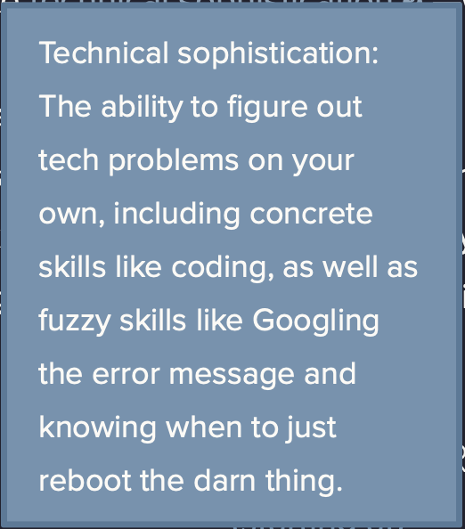

## An Inspiring TED Talk: [How to get Serious About Diversity and Inclusion in the Work Place](https://www.ted.com/talks/janet_stovall_how_to_get_serious_about_diversity_and_inclusion_in_the_workplace?language=en)
How can I help and be a part of growth and change regarding diversity and inclusion? I can START by sharing the thoughts, words, and actions of leaders. Then, I can be an advocate in my own environments.

## Something I got to work: [My First GraphQL Query using GraphiQL](https://electronjs.org/apps/graphiql)

While working through the [GatsbyJS](www.gatsbyjs.org) tutorials mentioned in a previous post, I learned how to make a GraphiQL query. I'm finding simple joy in building these basics and trusting that the skill is something I will know to grab for when the time and challenge is right.

## Something I will probably always be working on: Timing My Goals

I've been setting weekly goals with my mentor, a weekly [twitter chat called CodeNewbie Check-in](codenewbie.org) on Sundays at 11Am pst/2PM est, and with myself. I consistently fall short. Not due to lack of time spent on them. My need to have self effecacy as a developer is brand new! So, I've started to log my hours. What time do I start? As soon as I get distracted, I log that time. What was the distraction? What did I get done up until that distraction? How long was I distracted for? How long was I focused? What's my mood? Is that getting in the way of studying and working? How long did I think that task would take? How long did it actually take?

This topic goes hand in hand with a conversation I had with my mentor about the definition of failure. That term can be so personal. As a pre-bootcamp dev in training, I, and many others, are in a unique position to build a foundation of good habits. This habit is an attempt to soften the potential of failing myself by setting unrealistic expectations from the start. Although goal setting in this environment is currently a struggle, it really is already a success by birthing awareness. Here we go.

## A Course for Total Newbs: [Learn Enough Command Line to be Dangerous](www.learnenough.com)

I've already mentioned this in a previous post where I start explaining the first module. Since I am currently working from home and essentially self motivating, I've found that I need a starter activity. JUST something to get me going for the day. This course is perfect because it both challenges me and meets my currently skill set. Find this thing for yourself. Find the thing that greets you into your work day especially when you sense that little bit of resistance to getting started.

## A Term I Borrowed From [Michael Hartl](https://www.michaelhartl.com): Technical Sophistication

