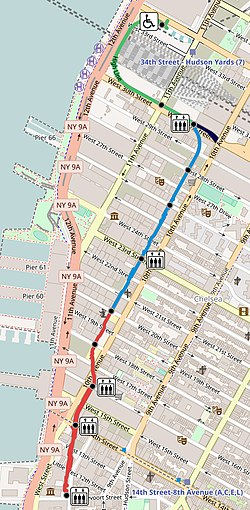

## A (Tiny) Story About How I Started Coding

“Now, how does that relate to what you’ve been doing?” - a common question asked by the healthy skeptics peppering my vast and florid relationships with friends and family. When I enthusiastically tell people that I am joining a coding bootcamp, part of the thrill is taking them along for the ride that my imagination took when I discovered that creating functions to solve problems with programming languages was something I actually enjoyed, just for the pure and complex beauty of creating algorithms. As an academic educator and musician I have been full of awe and enthusiasm for the technical tools that have granted my students, fellow musicians, and myself access to enriched learning and artistic production.

Last year my life’s pixels started to take new form. Despite outside skepticism, I trusted my professional process. In 2008, after graduating with a degree in supply chains and economics, my professional life was more driven by a formative relationship with my brother who has autism. I worked in the field of  special education which fulfilled my hunger to understand and nurture cognitive processes of individuals with neuro-diversity. I taught in public schools and then later  ran my own tutoring business, while simultaneously pursuing a degree in music and becoming a performer. One of my math students and friend had just finished Hack Reactor and wished to study AI, so we traded coding lessons for math lessons. Fully stimulated by the content, I went full throttle studying JavaScript, command line, git, CSS, and HTML. I know and trust that it all relates.

## My New Crush: The High Line at 6PM

At 6PM in the middle of July, the lighting has this incredible toasted glow. I quite literally had butterflies in my stomach, grinning until my cheeks went sore, as the sun and I sauntered south down the High Line.

## My Cyclone Though an Intro to Git [Git Immersion Lab](http://gitimmersion.com/)

I made a mess.

I now know what I need to pay attention to in order to NOT make such a mess of committing to the wrong branch-- be VERY attentive of the branch I am checking out. However, because I made this mess in the first place earlier last week, I was already able to recover from a little mess I made trying to deploy this site today. Success!

## Stage 1 of Hack Reactor Pre-Course Complete
Here's a list of what I learned

JS Fundamentals  | Git and The Command Line  | Automated Testing | Debugging
------------- | ------------- | ------------- | -------------
HTML/CSS  | How to Use the Terminal  | [Mocha](https://mochajs.org/) | [Underscore.js](https://underscorejs.org/)
Values and Types  | Forks and Pull Requests | [Chai](https://www.chaijs.com/) | DevTools Basics
Operators, Expressions, Statements | Git Work Flow | [Jasmine](https://jasmine.github.io/1.3/introduction.html) |
Variables |  | |
Objects and Properties | | |
Arrays  | | |
Functions  | | |
Parameters  | | |
