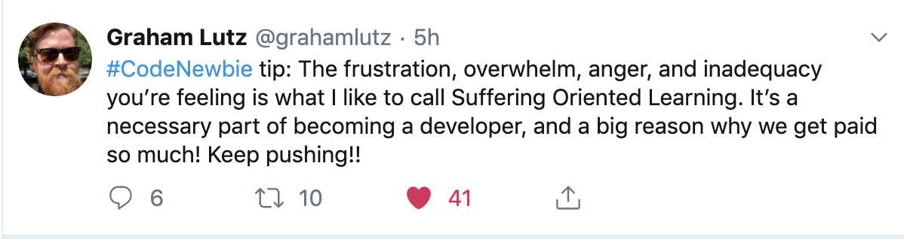

## The Team That Made This Month a Success:

I received an email a few weeks ago - mid precourse work. Hack Reactor expects that you will enter the bootcamp with a strong foundation in Javascript and the skills to navigate and parse high volumes of new information in a very short amount of time. We know this, its widely advertised and addressed very clearly throughout the admissions process. Working through percourse is a stage where you're both still working through part of the admissions process while simultaneously enrolled in the program. The email I received kicked me into **HIGH** gear... Like I was already in 5th and now need to stay in 7th.

*The Hack Reactor Team wanted to make sure I was actually a good fit for the program after viewing my early precourse work and evaluating a check-in with my resident*

This was enough of an adrenaline rush to plant a seed of what I believe to be a mindset that will enable success for the rest of this course, and as an engineer in the field. The first thing I did was reach out for some help. I am a strong self-learner and part of that process is gathering the human resources to bounce ideas off of, work through emotional challenges of learning new concepts and mindsets, and practice languages **outloud** not just typing, writing, and talking to yourself. Each of the following people (who I will only refer to with initials) uniquely contributed to the success of this past 3 weeks. I am incredibly thankful for their support and to me it really reflects upon the kind of community developers are striving to create and maintain.

| Who? | How did they help??  |
| ---- |:-------------:| 
| AR | Advised me to trust the decisions, procedures, and language of the HR team when they said that they give these readiness assessments liberally. She wisely suggested that although "not being anxious" may not be an option, I could have confidence that I have been consistently doing everything in my power to prepare for the program up until now. This was so helpful because although not all students need to take a Readiness Assessment, it forced me to look deeply into my process and maintain positivity inorder to continue to work hard rather than let anxiety take me by the throat. She has a podcast addressing tech and health issues [@fullstackHealth](https://fullstack.health/). The episode on anxiety was particularly helpful.| 
| BW | By explaining a project that I had completed, but still felt blinded by, I was able to practice the necessary "human language" to communicate ideas about this project and reveal gaps in my understanding and workflow. In particular, this meeting reminded me to use Google DevTools to preview styles in CSS since CSS is a brandnew language for me.| 
| LS | As a Hack Reactor Alum, she shared anecdotes from her cohort, explaining that even if a student was deferred to a later cohort, all of those students now have jobs as engineers and that the intention of the assessments really is to make sure that students are able to keep up and not fall behind. The HR team has your back. We also ran a practice interview. I highly suggest practice interviews with people you already know and trust. It helps to set a tone of trust and calm for future interviews. Although LS's question really took me through some unfamiliar twists and ultimately defeated me, it was incredibly helpful to work through my interview/testing jitters on a problem that was a bit over my head and get feedback from a professional and a friend.| 
| PE | This person was accepted into the HR program as we were working together. I reached out on the prep course slack channel with a request to pair program remotely with someone I didn't know. I got really luckly with this partner. He has done some serious self study as a programmer and is very technically knowledgeable. Although I already knew how to create and run my own tests, we pair programmed on some intermediate JS problems from [CoderBye](https://coderbyte.com/) and created multiple offical tests. It was fascinating wokring out this first pair programming experience especially since we were at very different levels technically. I found that assigning each other different tasks allowing us to work as a team and still complete the problems required empathy, confidence, and communication about our abilities and outcome expectations.|
| KM | We debugged a test in the precourse work and attempted to rewrite that code to match the debugged test. After working together, I really understood how important it is to thinking about and create test cases for my programs, not just to see if they work, but deeply understand **HOW** they work|
| BS | The process that we went through was intense and gratifying. I worked through one of the precourse repos with this person and explained exactly how I was thinking about each step of the problem - character by character. We built some library functions, exposed gaps in both of our knowledge when it came to building those programs, and worked to fill those gaps by researching together, maintaining a dialogue, and testing. The way we worked through problems really forced me to slow down and understand every key that I was pressing as I solved a problem and at this stage, there is no room for thoughtless typing - foundations are precious, **DO NOT SHORTCUT!**|

## This is the Thing I Wish I Found At the Start: [Frontend Masters](www.https://frontendmasters.com)

There are heaps of really thorough courses in here for all levels. I'm particularly enjoying the pedagogy of Kyle Simpson, author of [You Don't Know JS](https://www.amazon.com/gp/bookseries/B01N9EBP9V). Although there are obviously many many free resourses, if you're just starting off and are serious about coding, the $40.00/month subscription is really worth it.

## A Bit of Encouragement from the Twitter Dev Community: Suffering Oriented Learning

## A Breakdown to Avoid Breakdown: [How to Code Anything in 6 Steps](https://leewarrick.com/blog/how-to-learn-anything/)

I will be reading this a few more times I imagine

## Just5 $: Cannolis!
I moved to Manhattan 2 days ago! Night 1 featured a jaunt to Little Italy to try some cannolis. The mini plain ones are $3 each so I compared Cannoli King with Cafe Napoli. The latter had a much crunchier shell. The filling was more plentiful and its flavor was robust! I will give Cannoli king another try sometime- perhaps my tongue was over stimulated after Cafe Napoli's morsel.

