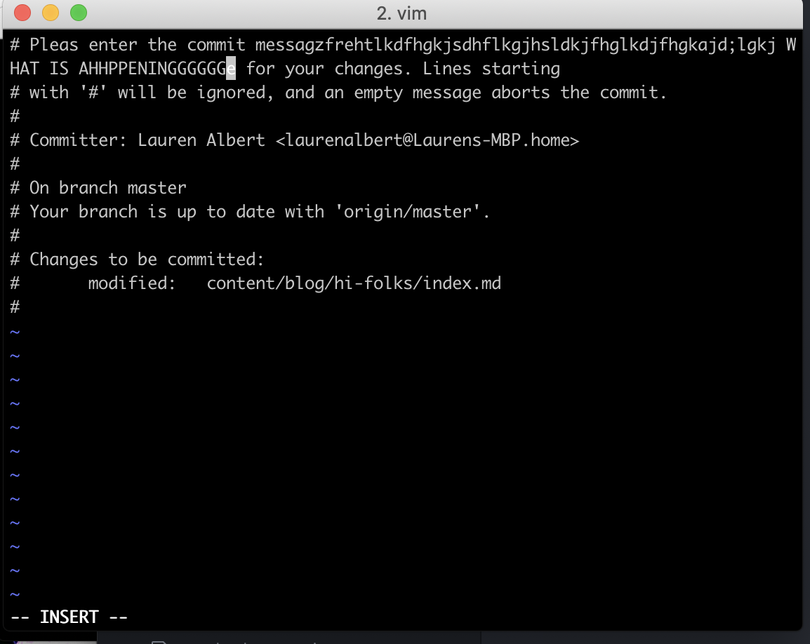

I started using the command line for the first time while working through the GatsbyJS tutorials. Here were my first few attempts at exiting VIM:

...at which point, I inevitably needed to learn some basic command line magic.

##Lesson 1: Being Basic using [Learn Enough Command Line to be Dangerous](www.learnenough.com)

This was a relaxing lesson because up until now, I was resolving my furrowed brow when stuck in vim by exiting the terminal-- nope! don't do that. Instead, here is an image of the shortcuts learned and practiced:

##A lil gift for beginner beginners

The vocab and acronyms for a beginner can be brutal. Here is a running compilation of some command line language. Quiz yourself! Old School learning works!

[CLI Quizlet](https://quizlet.com/_6ulj8p)
